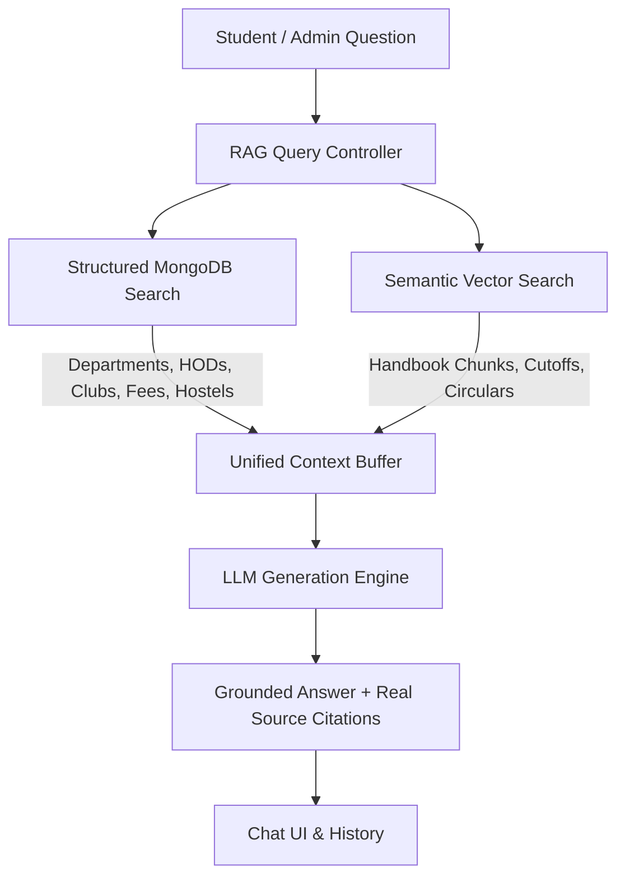

# PCCOE Digital Assistant & Enterprise RAG AI Platform

An enterprise-grade, full-stack Retrieval-Augmented Generation (RAG) AI Assistant engineered for **Pimpri Chinchwad College of Engineering (PCCOE), Pune** (Autonomous Institute, NAAC 'A++', DTE Code: 6175).

The platform combines **Structured MongoDB Knowledge Models** with an **Unstructured Vector Semantic Search Pipeline** and **Large Language Models (LLMs)** to deliver accurate, grounded, and verifiable answers with source citations.

---

## 🏛️ Core Architecture & Hybrid RAG Pipeline



### 1. Ingestion Pipeline (Unstructured Knowledge)
1. **Document Upload**: PDF, TXT, DOCX uploaded via the Admin Portal or auto-indexed on startup.
2. **Text Extraction & Page Mapping**: Preserves accurate page numbers and document metadata.
3. **Paragraph-Aware Chunking**: Chunks text by logical sections without breaking numbers or percentiles (`1400` chars with `150` char overlap).
4. **Vector Embedding**: 128-dimensional dense semantic vectors with character n-gram hashing and stop-word filtering.
5. **Vector DB Upsert**: Stored in Pinecone / High-Performance In-Memory Vector Store with metadata (`documentId`, `documentTitle`, `pageNumber`, `chunkIndex`, `department`, `collectionName`, `text`).

### 2. Query Pipeline (Hybrid Retrieval)
1. **Question Embedding**: Generates vector representation for the student query.
2. **Semantic Search & Hybrid Re-Ranking**: Computes cosine similarity scores with exact keyword salience.
3. **Structured MongoDB Query**: Retrieves structured profiles (Departments, HODs, Placements, Hostels, Scholarships, Clubs).
4. **Context Construction**: Assembles structured database records + top relevant document chunks into a unified prompt context.
5. **LLM Synthesis**: The LLM analyzes the context and synthesizes a natural, factual response without hallucinations.
6. **Source Attribution**: Attaches verified source citations with document titles, page numbers, and relevance percentages.

---

## 🚀 Key Features

- **Autonomous Academic Regulations**: In-Sem (ISE 40 marks), End-Sem (ESE 60 marks), and 75% attendance policy.
- **CAP Admissions & Cutoff Archives**: DTE Code 6175, MHT-CET & JEE Main cutoffs spanning 2023, 2024, 2025, and expected 2026.
- **Student Clubs & Associations**: Complete profiles for ITSA (Information Technology), CESA, Team Kratos Racing (TKR), Robocon, and Inspiria symposium.
- **Training & Placement (T&P)**: Highest package (61.0 LPA), average package (8.4 LPA), and marquee recruiters (Microsoft, Barclays, Adobe, TCS, ZF Group).
- **Hostel & Campus Life**: Nigdi campus boys & girls hostels, annual fees (Double Rs. 95k / Triple Rs. 75k / Mess Rs. 38k), and curfew timings (9:30 PM).
- **MahaDBT Scholarships**: EBC 50% tuition waiver, TFWS 100% waiver, and category freeships.
- **Real-Time RAG Diagnostics**: Dedicated diagnostic test runner and health monitor (`/api/admin/diagnostics`).
- **Zero Hallucination Guardrails**: Strict refusal on out-of-domain questions with 0 fake sources attached.

---

## 🛠️ Technology Stack

| Layer | Technologies |
|---|---|
| **Frontend** | React 18, TypeScript, Tailwind CSS, Lucide Icons, Vite |
| **Backend** | Node.js, Express, TypeScript, RESTful API |
| **Database** | MongoDB Atlas / In-Memory Mock Database |
| **Vector Store** | Pinecone Vector Database / High-Performance In-Memory Vector DB |
| **LLM Providers** | OpenRouter (`openrouter/auto`), Google Gemini, OpenAI |
| **Embeddings** | Dense 128-d Vectorizer / Google Gemini Embeddings |

---

## ⚙️ Environment Variables

Create `.env` in the root and `backend/`:

```env
NODE_ENV=development
PORT=5000
FRONTEND_URL=http://localhost:5173

# Database
MONGODB_URI=mongodb://localhost:27017/pccoe-college-rag-chatbot

# Authentication
JWT_SECRET=pccoe_rag_jwt_super_secret_production_key_2026
JWT_EXPIRES_IN=7d

# LLM Providers (openrouter | gemini | openai)
LLM_PROVIDER=openrouter
OPENROUTER_API_KEY=your_openrouter_key
LLM_MODEL=openrouter/auto

# Embeddings
EMBEDDING_PROVIDER=local
EMBEDDING_MODEL=dense-128

# Vector DB (memory | pinecone)
VECTOR_STORE_PROVIDER=memory
PINECONE_API_KEY=
PINECONE_INDEX=pccoe-rag

# Admin Seed
ADMIN_EMAIL=admin@pccoe.org
ADMIN_PASSWORD=PccoeAdmin2026!
ADMIN_NAME=PCCOE Administrator
```

---

## 📦 Setup & Local Run

### 1. Install Dependencies
```bash
# Install backend dependencies
cd backend
npm install

# Install frontend dependencies
cd ../frontend
npm install
```

### 2. Run Locally
```bash
# In the root directory:
npm run dev
```

- **Frontend Application**: [`http://localhost:5173`](http://localhost:5173)
- **Backend API**: [`http://localhost:5000`](http://localhost:5000)
- **RAG Diagnostics**: [`http://localhost:5000/api/admin/diagnostics`](http://localhost:5000/api/admin/diagnostics)

### 3. Run Automated Acceptance Suite
```bash
cd backend
npm run build
node dist/utils/testRagPipeline.js
```

---

## 👥 Demo Login Accounts

| Role | Email | Password |
|---|---|---|
| **PCCOE Administrator** | `admin@pccoe.org` | `PccoeAdmin2026!` |
| **Student** | `student@pccoe.org` | `PccoeStudent2026!` |

---

## 📄 License
MIT License. Built for **Pimpri Chinchwad College of Engineering (PCCOE), Pune**.
